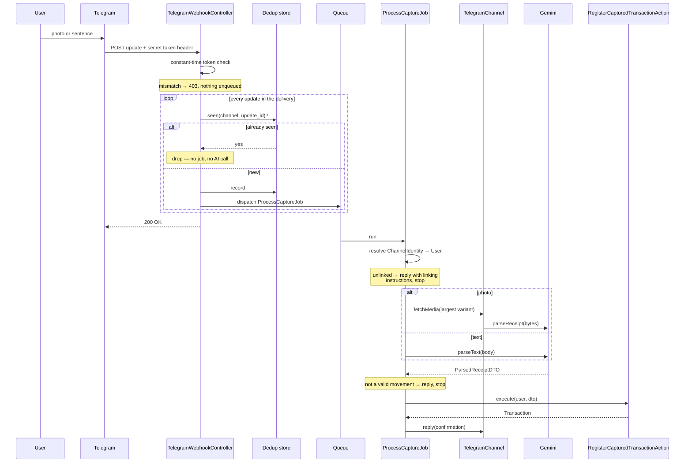

# Design — Telegram capture channel

- **Change:** `telegram-capture-channel`
- **Subdomain:** Ingestion
- **Date:** 2026-08-06
- **Spec:** [`specs/ingestion/spec.md`](specs/ingestion/spec.md)

## Owning services

Per the architectural rule — one owning Service per subdomain; Controllers, Jobs, Actions
and Imports orchestrate but do not decide:

| Subdomain | Owning service | State |
|---|---|---|
| Ingestion | `CaptureChannelRegistry` + per-channel adapters | **new** |
| Entity Resolution | `DetailResolver` | **new** — extracted here, see below |
| Categorisation | `CategorizationService` | unchanged |

Layout stays logical. Nothing moves to `app/Modules/`.

## The port

Exploration established that `RegisterWhatsAppTransactionAction(User, ParsedReceiptDTO)`
is already channel-agnostic. Only three responsibilities are genuinely per-channel, so the
port has exactly three methods:

```php
interface CaptureChannel
{
    /** Stable channel key persisted in channel_identities.channel. */
    public function key(): string;

    /** Retrieve the bytes and mime type an inbound capture refers to. */
    public function fetchMedia(string $mediaReference): ?CapturedMedia;

    /** Reply to the sender in their own channel. */
    public function reply(string $externalId, string $text): void;
}
```

`TelegramChannel` implements it with `getFile` + the file download endpoint and
`sendMessage`. `WhatsAppChannel` wraps the existing `MetaMediaService` and
`WhatsAppNotificationService` so the current jobs keep working unchanged in behaviour.

Everything downstream stays as it is:

```
capture → GeminiVisionService | GeminiTextService → ParsedReceiptDTO
        → RegisterCapturedTransactionAction
        → DetailResolver → CategorizationService → Transaction
```

## Entity Resolution extraction — ADR-0005 trigger

Slice 1 renames `RegisterWhatsAppTransactionAction` → `RegisterCapturedTransactionAction`,
which means it touches the file where finding F6 lives. Under
[ADR-0005](../../../../docs/decisions/0005-opportunistic-hexagonal-refactor.md) that is
exactly when the extraction is permitted, so it happens here and not as a standalone
change.

`DetailResolver` becomes the single home for resolve-or-create-`Detail`:

- `RegisterCapturedTransactionAction` and `Imports/TransactionYapeImport` both call it.
- The trigram threshold gets one definition. **Preserve the effective value `0.6`** — both
  call sites hardcode it today. `CategorizationService::THRESHOLD_TRIGRAM = 0.4` is
  declared and referenced nowhere; it is removed rather than adopted, because adopting it
  would silently change matching behaviour inside a refactor slice.

**Slice 1 changes no behaviour. The existing suite is its contract and must pass
untouched.**

## Flow



Two placements carry weight:

**The token check is middleware, not controller code.** It is a boundary concern, it must
run before any decision about the body, and keeping it out of the controller preserves the
orchestrator rule.

**Deduplication happens in the controller, before dispatch.** Checking inside the job would
mean a duplicate delivery has already cost a Gemini call. Rejecting at the edge makes it
free — that is QA-6 paid for by one index lookup.

## New PostgreSQL objects

Per `.agents/rules/02-database-dba.md`: every table and column commented, all timestamps
`timestamptz`, indexes explicit.

### `channel_identities`

Replaces `users.whatsapp_phone`, which cannot survive a second channel.

| Column | Type | Notes |
|---|---|---|
| `id` | `bigserial` | |
| `user_id` | `bigint` | FK → `users`, `on delete cascade` |
| `channel` | `varchar(20)` | `telegram`, `whatsapp` |
| `external_id` | `varchar(64)` | Telegram chat id, or E.164 digits without `+` |
| `linked_at` | `timestamptz` | |
| `legacy_whatsapp_phone` | `varchar(20)` nullable | Pre-migration value, retained until archive |

- `unique (channel, external_id)` — enforces one account, one user
- `index (user_id)`

`legacy_whatsapp_phone` exists solely so the destructive migration is reversible. It is
dropped when the change is archived, and that is recorded as an archive task.

### `channel_link_tokens`

| Column | Type | Notes |
|---|---|---|
| `id` | `bigserial` | |
| `user_id` | `bigint` | FK → `users`, `on delete cascade` |
| `token_hash` | `varchar(64)` | SHA-256 of the token. **The token itself is never stored** |
| `expires_at` | `timestamptz` | |
| `redeemed_at` | `timestamptz` nullable | Non-null means spent |

- `unique (token_hash)`
- `index (expires_at)` for pruning

Storing only the hash means a database leak yields no usable tokens. Comparison is
constant-time.

### `processed_channel_updates`

| Column | Type | Notes |
|---|---|---|
| `id` | `bigserial` | |
| `channel` | `varchar(20)` | |
| `external_update_id` | `varchar(64)` | Telegram `update_id` |
| `processed_at` | `timestamptz` | |

- `unique (channel, external_update_id)` — the deduplication guarantee lives in the index,
  not in application logic, so a race between two workers cannot double-insert
- `index (processed_at)` for pruning

Retention is sized to the provider's retry window, not kept forever. Pruning is a
scheduled command.

## Link token lifecycle

1. The SPA requests a token for the authenticated user.
2. The API generates random bytes, stores only the SHA-256 hash with an expiry, and returns
   a deep link — `https://t.me/<bot>?start=<token>`.
3. The user taps it; Telegram opens the bot and sends `/start <token>`.
4. The bot hashes the received token, finds an unexpired unredeemed row, creates the
   `ChannelIdentity`, and stamps `redeemed_at`.

Refusals — expired, already redeemed, bad signature, account already bound — all return
the same generic reply. Distinguishing them would tell an attacker which tokens exist.

**A token is a credential.** Short expiry, single use, and never logged.

## Configuration

| Key | Purpose |
|---|---|
| `services.telegram.bot_token` | Bot API authentication |
| `services.telegram.secret_token` | Value registered with `setWebhook`, echoed in the header |
| `services.telegram.bot_username` | Deep-link construction |

A missing `secret_token` fails every delivery closed, logged distinctly from a mismatch.

## What is deliberately not built

- **No coaching.** No unprompted message, no question from the system, no conversational
  state. `CaptureChannel::reply` answers a capture and nothing more. The interface will
  need an outbound counterpart for coaching; that is the next change's problem, and
  guessing its shape now would be speculative.
- **No factura or boleta modelling.** `ParsedReceiptDTO` is untouched.
- **No `KeywordRule` write path.**
- **No rate limiting per sender.** Recorded as a follow-up; it is a real gap once the bot
  is public.

## Migration and rollback

| Slice | Reversible by | Note |
|---|---|---|
| 1 — port | reverting the commit | No persisted state |
| 2 — identity | `legacy_whatsapp_phone` | **Only destructive step.** Its `down()` cannot reconstruct the original strings otherwise |
| 3 — adapter | reverting the commit | Additive. `deleteWebhook` disables the channel with no deploy |

The identity migration must **abort rather than guess** on any row it cannot normalise,
and log every row it changes. `channel_identities.external_id` is unique per channel; a
collision means two users claimed the same number and needs a human, not a heuristic.
